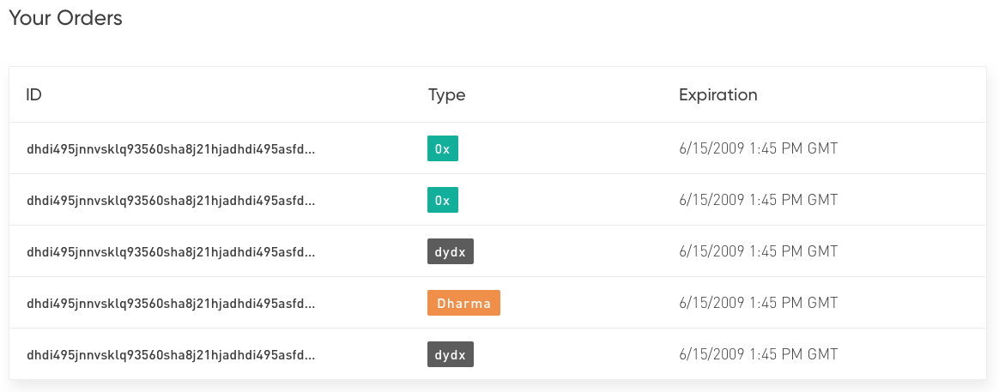
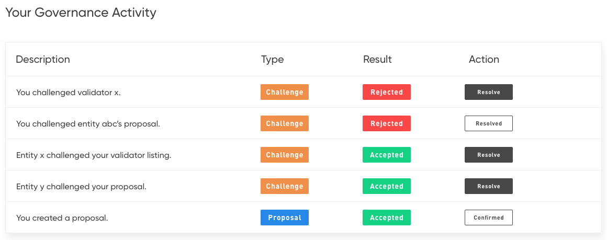

# Portal specification: `Account`

Hello, world!

## Background

What's up world.

## Description

The following sections serve to annotate states of [the sketch file](./account.sketch) with the functionality that must be implemented for each.

Code samples for the non-obvious implementation components, and usage of the `kosu.js` library are [included below](#code-samples), and linked to from each detail section.

Many intermediary states (such as the confirm/confirming/confirmed flow for action buttons) are not displayed here for the sake of brevity, so refer to the sketch file for detailed intermediary states.

Be sure to review the sketch file in full for an overall understanding of the interface prior to reviewing this section.

### Main page

The account portal is essentially one main page, with three data/interactive sections:
- Your tokens: manage your balances within the Kosu system.
- Your orders: view orders you've posted to the Kosu network.
- Your governance activity: view your past participation in network governance.

On load, the main page has no ability to display data before the user clicks "connect to Metamask" allowing the web app access to the Ethereum blockchain. 

#### Before Metamask connection
https://sketch.cloud/s/VvZQ8/a/VmJeWa

- Displays the main page prior to Metamask connection.
- Upon clicking the button, the app should attempt to [connect to Metamask](#connecting-to-metamask).
- If it is determined the browser is incompatible, handle appropriately.

#### Connected, no allowance
https://sketch.cloud/s/VvZQ8/a/bd5kx9

- Displays the main page after `window.ethereum` has been `.enable`d during Metamask connection.
- The methods for loading all data displayed in this image are discussed in the sections below.
- Treasury, tokens bonded, and tokens staked cards are all greyed out if [no treasury allowance is detected](#view-treasury-allowance).
- Clicking on one of the greyed out cards prompts the user with a transaction to [set an "unlimited" allowance for the Treasury](#set-treasury-allowance).

#### Connected, allowance set
https://sketch.cloud/s/VvZQ8/a/vJ0WRb

- After an [allowance for the treasury](#set-treasury-allowance) has been set, the cards are fully visible.

### Balance page
_Each card in the "your tokens" UI section has a sub-section here._
https://sketch.cloud/s/VvZQ8/a/dGKYj2

- The "your tokens" section gives the user information about their token balances, and allows them to interact with the Kosu treasury and poster registry contracts.
- Descriptions of each card's contents, and where to load the value from is described below.
- The "write" actions (deposit, bond, etc.) for this "your tokens" component are described in a later section.

#### Total balance
- The sum of the tokens held within the user's wallet, and the Kosu contract system.
- See [this example for computing total balance.](#compute-total-balance)

#### System balance
- The number of tokens the user has contained within the entire Kosu system.
- Load this value [with the `treasury.systemBalance` method.](#view-system-balance)

#### In wallet
- The number of tokens in the users personal wallet.
- Load this value [by querying the `kosuToken` contract.](#view-token-balance)

#### Bonded
- The number of tokens the user has bonded in the `PosterRegistry` contract.
- Load this value [with the `posterRegistry.tokensContributedFor` method.](#view-bonded-token-balance)

#### Staked
- The number of tokens the user has at stake in challenges or validator listings. 
- This value [must be computed based on other balances.](#compute-staked-tokens)

#### In treasury
- The number of tokens deposited in the treasury by the user, and not held up in other contracts (posting, staking, etc.).
- Load this value [with the `treasury.currentBalance` method.](#view-treasury-balance)

### Treasury

This section describes how to interact with the treasury beyond just viewing balances (described above) for actions such as `deposit` and `withdraw`.

As detailed below, the cases of "adding to treasury" and "editing treasury balance" are handled separately. I.E., when the user has no treasury balance there is an option to add tokens, which is a separate user flow than if they already had tokens and are editing their balance or withdrawing. 

#### Initial add to treasury
https://sketch.cloud/s/VvZQ8/a/OkrJe8

- If the user [has no tokens in the treasury,](#view-treasury-balance) the "add" button should be displayed in the top-right of the "in treasury" card.
- Clicking this button brings the user to the state displayed above, where they are prompted to enter an amount of tokens to deposit.
- If this amount is 0, or greater than their current [wallet balance](#view-token-balance) the "add" button should be disabled.
- Clicking the "add" button should [deposit tokens into the treasury](#deposit-tokens) of the specified amount.
- Remember to convert ether (units entered) to wei (units passed to contract call).
- The "add" button should indicate the transaction is confirming ("adding..." or a spinning loop) until the promise returned by the `deposit` method resolves, at which point the pop-up can close.

#### Display edit button after deposit
https://sketch.cloud/s/VvZQ8/a/DvxDEq

- If the user [has a non-zero treasury balance](#view-treasury-balance) (i.e. they just deposited, as described above) the "add" button should be replaced with an "edit" button.

#### Edit popup
https://sketch.cloud/s/VvZQ8/a/jOzY40

- Clicking the "edit" button brings the user to this popup, which prompts to ["edit current balance"](#adjust-button) or to ["remove entire balance"](#withdraw-all).
- The "edit current balance" brings the user to a further popup (next sub-section).
- The "remove entire balance" button should [trigger a withdrawal](#withdraw-tokens) after the [confirmation is clicked](#withdraw-all).

#### Adjust button 
https://sketch.cloud/s/VvZQ8/a/zGRWyW

- The adjust page [displays the users current treasury balance](#view-treasury-balance), and has a field to enter a new balance.
- After entering a new balance, the page should display the necessary change:
  - If the new balance is less than current, display "tokens to remove:" and the amount that will be withdrawn.
  - If the new balance is greater than current, display "tokens to add:" and the amount that will be deposited. 
- Depending on the users specified new balance, the appropriate call to either [`deposit`](#deposit-tokens) or [`withdraw`](#withdraw-tokens) should be made with the correct amount.
- Keep in mind the user is entering units of ether, but units of wei must be passed into the deposit and withdraw methods.
- Clicking update balance should replace the buttons text with a loading animation that spins until the promise from the `withdraw` or `deposit` resolves.
- After the resulting transaction confirms, the pop-up should close.
- Sample `updateBalanceTo` method:
  ```typescript
  async function updateBalanceTo(newBalance: string): Promise<void> {
    const newBalanceWei = new BigNumber(web3.utils.toWei(newBalance));
    const currentBalanceWei = await kosu.treasury.currentBalance(await web3.eth.getCoinbase());
    if (newBalanceWei.comparedTo(currentBalanceWei) === 1) {
      // deposit difference
      return await kosu.treasury.deposit(newBalanceWei.minus(currentBalanceWei));
    } else if (newBalanceWei.comparedTo(currentBalanceWei) === -1) {
      // withdraw difference
      return await kosu.treasury.withdraw(currentBalanceWei.minus(newBalanceWei));
    } else {
      // same amount, no action needed
      return;
    }
  }
  ```

#### Withdraw all 
https://sketch.cloud/s/VvZQ8/a/l9m9KO

- If the user clicks "remove entire balance" from the [edit popup](#edit-popup), they are prompted to confirm.
- If they click confirm again, their full [treasury balance](#view-treasury-balance) should be [withdrawn from the treasury](#withdraw-tokens).
- While the transaction is confirming, the "confirm" text in the button should be replaced with a loading icon that spins until the promise returned by `withdraw` resolves.

### Bonding

After an allowance is granted to the treasury, the user may "bond" tokens by locking them in the `PosterRegistry` contract.

The "bonded" card within the "your tokens" section has a button ("add"/"edit") that allows the user to bond and un-bond tokens.

Similar to the treasury card, the cases of an "initial add" versus a "subsequent edit" are treated separately at the UI level. This is described below. 

#### Initial add bond
https://sketch.cloud/s/VvZQ8/a/7OKeWZ

- The "bonded" tokens card has a "bond" button in the top right.
- If the user [has no tokens bonded already](#view-bonded-token-balance), clicking bond brings them to this sate.
- The confirm button is greyed out until they enter an amount (next sub-section).

#### Initial add bond enter amount
https://sketch.cloud/s/VvZQ8/a/yeovKK

- As the user types in an amount, the progress bar below shows what percentage of their treasury balance it would use. 
- If they enter an amount greater than what they currently have in the treasury, "confirm" should be greyed out. 
- As they enter an amount of tokens to bond, an [estimate of their order post limit](#estimate-post-limit) should be displayed.
- When an amount is entered, clicking "confirm" will [trigger a bond](#bond-register-tokens) of the amount they entered.
- Be sure to convert to wei from ether, and use a `BigNumber` for the value.
- Clicking confirm submits the transaction (after prompting for signature), and while the transaction is confirming, a loading icon (in sketch file) should spin.
- The icon can stop and the window can close when the promise returned by the `registerTokens` call resolves.

#### Subsequent edit bond
https://sketch.cloud/s/VvZQ8/a/g4PVvM

- For subsequent bonding actions (when [bonded balance](#view-bonded-token-balance) is greater than 0) this display should be used.
- It is similar to the initial bond screen discussed above, but displays the current balance above the entry field, and allows users to un-bond by entering an amount less than their current bonded balance.
- "New order post limit" should [be calculated as discussed above.](#estimate-post-limit)
- The "update bond" button should be greyed out until a valid amount is entered.

#### Subsequent edit bond enter amount
https://sketch.cloud/s/VvZQ8/a/8m7GEx

- As an amount is entered, the "update bond" button should become available and the "new order post limit" should be calculated and displayed (after a delay to allow typing).
- Similar to the [treasury adjust page](#adjust-button):
  - If the "new bond amount" is less than "current bond," [the difference should be un-bonded.](#un-bond-release-tokens)
  - If the "new bond amount" is greater than "current bond," [the difference should be bonded.](#bond-register-tokens)
- Keep in mind ether/wei conversions and usage of `BigNumber` instances.
- When "update bond" is clicked, the call to `registerTokens` or `releaseTokens` will trigger a Metamask pop-up and prompt for a signature.
- While the transaction is being signed/mined, the "update bond" button text should be replaced with a spinning animation that spins until the promise returned by the register/release method resolves.

### Order table



The orders table displays orders the user has submitted to the Kosu network. 

Currently, the infrastructure and services necessary to support this feature are not yet implemented, so it must be mocked temporarily (see below).

In production, the table can simply be empty and display "no orders found" or something of the sort. 

#### RPC API request format
- This API does not exist yet, but the [data from the section below](#rpc-api-response-format) can be used for mocking.
- Eventually, a RPC API will be availible to return an array of information about orders a given user has submitted to the network.
- The API request format will be:
  ```
  GET /api/v1/orders?makerAddress=${USER_ADDRESS}&number=${ITEMS_TO_SHOW}
  ```

#### RPC API response format
- The response will be sent with `Content-Type: application/json` headers.
- The response will be an array of objects (below) of the length specified as the "number" query parameter.
- The response from the eventual RPC API [above](#rpc-api-response-format) will look like:
  ```json
  [
    {
      "orderId": "0x8976d8e86f1500008976d8e86f15906a8976d8e86f15000040dc8b020190ab56",
      "type": "Dharma",
      "expiration": 1560371215
    },
    {
      "orderId": "0x20610504010a2be428610504010000002861050401000000701231030100e3ca",
      "type": "dY/dX",
      "expiration": 1560356165
    },
    {
      "orderId": "0xb461050401000000701231030100000206e65d06205040100d46205040100e2b",
      "type": "0x",
      "expiration": 1560332518
    },
    {
      "orderId": "0x0b3d075500bb7c51cfa6c746599a223b153d8379ff22ee95c338d8e5c02eff1a",
      "type": "0x",
      "expiration": 1560359948
    }
  ]
  ```

### Past governance activity table
 <!-- https://sketch.cloud/s/VvZQ8/a/M0P94m -->

## Code samples
Demonstrations of implementations of various necessary actions using the `kosu.js` and `web3` libraries.

- You must have the latest version of [`kosu.js`](https://www.npmjs.com/package/@kosu/kosu.js) installed in your project, as well as [a specific version of `web3`](https://www.npmjs.com/package/web3/v/1.0.0-beta.37). 
- The [`bignumber.js`](https://www.npmjs.com/package/bignumber.js) package should also be available. 
- Additional notes:
  - Examples include TypeScript type definitions where possible.
  - Where `kosu` is used, it refers to an instance of the `Kosu` class.
  - Similarly, `web3` refers to an instance of the `Web3` class.
  - The term `coinbase` refers to the user's primary unlocked account (in this context, their Metamask address).
  - Most numbers (from `kosu.js` and `web3`) are expected as, and returned as [`BigNumber`](https://www.npmjs.com/package/bignumber.js) instances.
  - Most token values are returned as, and expected in units of wei, so remember to convert where necessary.
  - Methods that use the `await` keyword imply they are in `async` functions, even if not shown.
  - Promise syntax may be used if necessary, but we recommend `async/await` where possible.

### Connecting to Metamask
- **Description:** the user will trigger this action, which requests from the injected provider to display accounts and access the Ethereum JSONRPC. 
- **Note:** this action should be triggered by the user, rather than `onload`.
- **Example:**
  ```javascript
  async function connectMetamask() {
        if (window.ethereum !== void 0) {
            try {
                await window.ethereum.enable();

                // load this web3 into state somewhere (needed later)
                web3 = new Web3(window.ethereum);

                // additionally, store the users address somewhere
                coinbase = await web3.eth.getCoinbase();
            } catch (error) {
                throw new Error("user denied site access");
            }
        } else if (window.web3 !== void 0) {
            // same as above, var (or let) scoped, or stored in redux state
            web3 = new Web3(web3.currentProvider);
            coinbase = await web3.eth.getCoinbase();

            // optional
            global.web3 = web3;
        } else {
            throw new Error("non-ethereum browser detected");
        }
    }
  ```

### View token balance
- **Description:** view the user's wallet balance of KOSU tokens in wei (does not include treasury balance).
- **Method:** `kosu.kosuToken.balanceOf`
- **Example:**
  ```typescript
  // Viewing user's KOSU wallet balance

  const coinbase: string = await web3.eth.getCoinbase();
  const balance: BigNumber = await kosu.kosuToken.balanceOf(coinbase);
  ```

### Set treasury allowance
- **Description:** indicate a number of the user's KOSU tokens (in wei) that the treasury may spend/move on their behalf.
- **Method:** `kosu.treasury.approveTreasury`
- **Notes:**
  - An allowance for the treasury must be set prior to bonding tokens or staking.
  - To set an "unlimited" allowance, you can use the maximum `uint256` value (shown below).
- **Example:**
  ```typescript
  // Setting an "unlimited" Treasury allowance

  const MAX_UINT_256_STR = "115792089237316195423570985008687907853269984665640564039457584007913129639935";
  const MAX_UINT_256: BigNumber = new BigNumber(MAX_UINT_256_STR);
  const MAX_UINT_256_WEI: BigNumber = new BigNumber(web3.utils.toWei(MAX_UINT_256));

  // will prompt for user signature (i.e. MetaMask)
  const receipt: TransactionReceiptWithDecodedLogs = await kosu.treasury.approveTreasury(
      MAX_UINT_256_WEI,
  );
  ```

### View treasury allowance
- **Description:** see the current treasury allowance for the user (detected via `coinbase`).
- **Method:** `kosu.treasury.treasuryAllowance`
- **Note:** this method is useful to detect if an allowance must be set for the user.
- **Example:**
  ```typescript
  // Reading the user's Treasury allowance

  const currentAllowance: BigNumber = await kosu.treasury.treasuryAllowance();
  ```

### Deposit tokens
- **Description:** transfer tokens from the user's wallet to the Kosu treasury.
- **Method:** `kosu.treasury.deposit`
- **Note:** the user must have sufficient [treasury allowance](#view-treasury-allowance) set prior to depositing.
- **Example:**
  ```typescript
  // Depositing 10 KOSU tokens into the Treasury

  const TEN_TOKENS_WEI: BigNumber = new BigNumber(web3.utils.toWei("10"));

  // will prompt for user signature (i.e. MetaMask)
  const receipt: TransactionReceiptWithDecodedLogs = await kosu.treasury.deposit(
      TEN_TOKENS_WEI,
  );
  ```

### Withdraw tokens
- **Description:** transfer tokens from the treasury to the user's wallet.
- **Method:** `kosu.treasury.withdraw`
- **Example:**
  ```typescript
  // Withdrawing 10 KOSU tokens from the Treasury

  const TEN_TOKENS_WEI: BigNumber = new BigNumber(web3.utils.toWei("10"));

  // will prompt for user signature (i.e. MetaMask)
  const receipt: TransactionReceiptWithDecodedLogs = await kosu.treasury.withdraw(
      TEN_TOKENS_WEI,
  );
  ```

### View treasury balance
- **Description:** view the number of tokens (in wei) the user currently has in the treasury.
- **Method:** `kosu.treasury.currentBalance`
- **Example:**
  ```typescript
  // Viewing user's current Treasury balance

  const coinbase: string = await web3.eth.getCoinbase();
  const systemBalance: BigNumber = await kosu.treasury.currentBalance(coinbase);
  ```

### View system balance
- **Description:** view the total number of tokens (in wei) the user has in the whole Kosu contract system.
- **Method:** `kosu.treasury.systemBalance`
- **Example:**
  ```typescript
  // Viewing user's current total system balance

  const coinbase: string = await web3.eth.getCoinbase();
  const systemBalance: BigNumber = await kosu.treasury.systemBalance(coinbase);
  ```

### View bonded token balance
- **Description:** view the total number of tokens (in wei) the user has bonded in the poster registry.
- **Method:** `kosu.posterRegistry.tokensContributed`
- **Example:**
  ```typescript
  // Viewing user's bonded tokens in PosterRegistry

  const coinbase: string = await web3.eth.getCoinbase();
  const bondedTokens: BigNumber = await kosu.posterRegistry.tokensRegisteredFor(coinbase);
  ```

### Bond (register) tokens
- **Description:** bond (lock) tokens into the Kosu poster registry contract for access to the Kosu network.
- **Method:** `kosu.posterRegistry.registerTokens`
- **Note:** the user must have sufficient [treasury allowance](#view-treasury-allowance) set prior to bonding.
- **Example:**
  ```typescript
  // Bonding 5 KOSU tokens in the PosterRegistry

  const FIVE_TOKENS_WEI = new BigNumber(web3.utils.toWei("5"));
  
  const receipt: TransactionReceiptWithDecodedLogs = await kosu.posterRegistry.registerTokens(
      FIVE_TOKENS_WEI,
  );
  ```

### Un-bond (release) tokens
- **Description:** un-bond (unlock) tokens from the Kosu poster registry.
- **Method:** `kosu.posterRegistry.releaseTokens`
- **Example:**
  ```typescript
  // Un-bonding 5 KOSU tokens from the PosterRegistry

  const FIVE_TOKENS_WEI = new BigNumber(web3.utils.toWei("5"));
  
  const receipt: TransactionReceiptWithDecodedLogs = await kosu.posterRegistry.releaseTokens(
      FIVE_TOKENS_WEI,
  );
  ```

### Compute total balance
- **Description:** use this sample to compute the total number of Kosu tokens a user has.
- **Methods:**
  - `kosu.treasury.systemBalance`
  - `kosu.kosuToken.balanceOf`
- **Example:**
  ```typescript
  // Computing a users total balance of Kosu tokens

  async function userTotalBalance(userAddress: string): Promise<BigNumber> {
    const systemBalance = await kosu.treasury.systemBalance(userAddress);
    const walletBalance = await kosu.kosuToken.balanceOf(userAddress);
    return systemBalance.plus(walletBalance);
  }

### Compute staked tokens
- **Description:** compute the number of tokens a user has staked in the validator registry.
- **Methods:**
  - `kosu.treasury.systemBalance`
  - `kosu.treasury.currentBalance`
  - `kosu.posterRegistry.tokensRegisteredFor`
- **Example:**
  ```typescript
  // Example function to get total staked tokens (in wei)

  async function tokensStakedFor(userAddress: string): Promise<BigNumber> {
    const systemBalance: BigNumber = await kosu.treasury.systemBalance(userAddress);
    const currentBalance: BigNumber = await kosu.treasury.currentBalance(userAddress);
    const registeredTokens: BigNumber = await kosu.posterRegistry.tokensRegisteredFor(userAddress);
    return systemBalance.minus(currentBalance).minus(registeredTokens);
  }
  ```

### Load past governance activity
- **Description:** an example of how to load past governance activity for a given user's account.
- **Methods:**
  - `kosu.eventEmitter.getPastDecodedLogs`
  - `kosu.validatorRegistry.getListing`
  - `kosu.validatorRegistry.getChallenge`
- **Note:** this code sample works, and produces the included output, however, it may need to be modified for the final portal. For example, title generation may need to be modified to trim addresses, etc.
- **Example:**
  ```typescript
  // Example of loading past governance activity

  interface GovernanceActivityItem {
    /** The title to display the user. */
    title: string;

    /** The type of activity, challenge (either created or in) or proposal. */
    type: "challenge" | "proposal";

    /** Outcome of the governance activity. */
    status: "rejected" | "accepted" | "pending";

    /** True if there is a action button that should be displayed to user. */
    actionable: boolean;

    /** If type == challenge, there is a challengeId. */
    challengeId: BigNumber | null;

    /** If a challenge, there is a challenger (it may be the user). **/
    challenger: string | null;

    /** The owner will be the user in the case of proposal, or a challenge against them. **/
    owner: string;

    /** Hex-encoded Tendermint public key used for certain queries. */
    listingKey: string;
  }

  export async function getPastGovernanceActivity(userAddress: string): Promise<GovernanceActivityItem[]> {
    const user = userAddress.toLowerCase();
    const allLogs = await kosu.eventEmitter.getPastDecodedLogs({
      fromBlock: 0,
    });

    const output = [];
    for (const log of allLogs) {
      const { decodedArgs } = log as any;
      const { eventType } = decodedArgs as any;
      switch (eventType) {

        // event indicating creation of a new proposal
        case "ValidatorRegistered": {
          const { owner, tendermintPublicKeyHex } = decodedArgs;
          if (owner !== user) {
            break;
          }

          const item = {
            type: "proposal",
            title: "You created a proposal",
            status: null,
            actionable: null,
            challengeId: null,
            challenger: null,
            owner,
            listingKey: tendermintPublicKeyHex,
          }

          // load listing state from contract system
          const listing = await kosu.validatorRegistry.getListing(tendermintPublicKeyHex);

          // listing is still pending
          if (listing.status == 1 && listing.confirmationBlock == 0) {
            item.actionable = true;
            item.status = "pending";

            // listing already confirmed
          } else if (listing.status == 2) {
            item.actionable = false;
            item.status = "accepted";

            // listing challenged and rejected
          } else if (listing.status == 0) {
            item.actionable = false;
            item.status = "rejected";

            // listing is currently in challenge 
          } else if (listing.status == 3) {
            item.actionable = false;
            item.status = "pending";
          }

          output.push(item);
          break;
        }

        // event indicating the creation of a challenge
        case "ValidatorChallenged": {
          const {
            owner,
            challenger,
            tendermintPublicKeyHex,
            challengeId
          } = decodedArgs;
          if (owner !== user && challenger !== user) {
            break;
          }

          const item = {
            type: "challenge",
            title: null,
            status: null,
            actionable: null,
            challengeId,
            challenger,
            owner,
            listingKey: tendermintPublicKeyHex,
          }

          const challenge = await kosu.validatorRegistry.getChallenge(new BigNumber(challengeId));
          const { listingSnapshot } = challenge;

          if (owner === user) {
            item.title = `${challenger} challenged your ${listingSnapshot.status === 1 ? "proposal" : "validator listing"}`;
          } else {
            item.title = `You challenged ${owner}'s ${listingSnapshot.status === 1 ? "proposal" : "validator listing"}`;
          }

          if (challenge.finalized === true) {
            item.actionable = true;
            if (challenge.passed === true) {
              item.status = "accepted";
            } else if (challenge.passed === false) {
              item.status = "rejected";
            }
          } else {
            item.actionable = false;
            item.status = "pending";
          }

          output.push(item);
          break;
        }

        // skip events we don't care about
        default: {
          break;
        }
      }
    }

    // reverse output so it shows newest first
    return output.reverse();
  }
  ```
- **Example output:**
  ```json
  [{
    "type": "challenge",
    "title": "0x8b366a3d4e46ac5406f12766ad33e6482ce4f081 challenged your validator listing",
    "result": "rejected",
    "actionable": false,
    "challengeId": "3",
    "challenger": "0x8b366a3d4e46ac5406f12766ad33e6482ce4f081",
    "owner": "0x8b366a3d4e46ac5406f12766ad33e6482ce4f081",
    "listingKey": "0xd76df5db00000000000000000000000000000000000000000000000000000000"
  },
  {
    "type": "proposal",
    "title": "You created a proposal",
    "result": "pending",
    "actionable": false,
    "challengeId": null,
    "challenger": null,
    "owner": "0x8b366a3d4e46ac5406f12766ad33e6482ce4f081",
    "listingKey": "0xd76df5db00000000000000000000000000000000000000000000000000000000"
  },
  {
    "type": "proposal",
    "title": "You created a proposal",
    "result": "accepted",
    "actionable": false,
    "challengeId": null,
    "challenger": null,
    "owner": "0x8b366a3d4e46ac5406f12766ad33e6482ce4f081",
    "listingKey": "0x726a2782ecac8eeb2d95eb667a16af7ad86b79ebda96275ab68aeca65b2996cb"
  },
  {
    "type": "proposal",
    "title": "You created a proposal",
    "result": "accepted",
    "actionable": false,
    "challengeId": null,
    "challenger": null,
    "owner": "0x8b366a3d4e46ac5406f12766ad33e6482ce4f081",
    "listingKey": "0xb618ac8ac8288a782da1b7a6cac79ca2776f6a589d6ada2b6eeb6cb62965a65b"
  },
  {
    "type": "proposal",
    "title": "You created a proposal",
    "result": "accepted",
    "actionable": false,
    "challengeId": null,
    "challenger": null,
    "owner": "0x8b366a3d4e46ac5406f12766ad33e6482ce4f081",
    "listingKey": "0x8ab79a965c9da27b649e8c306a1b62b20a229e0a276eecad7ab85a95f85eadec"
  },
  {
    "type": "challenge",
    "title": "0x8b366a3d4e46ac5406f12766ad33e6482ce4f081 challenged your validator listing",
    "result": "accepted",
    "actionable": true,
    "challengeId": "2",
    "challenger": "0x8b366a3d4e46ac5406f12766ad33e6482ce4f081",
    "owner": "0x8b366a3d4e46ac5406f12766ad33e6482ce4f081",
    "listingKey": "0x85e9ebca16ab75eaeca6e6e589c91ec9fa2bbda96275ab629e0b5e9dd7ab9a29"
  },
  {
    "type": "challenge",
    "title": "0x8b366a3d4e46ac5406f12766ad33e6482ce4f081 challenged your proposal",
    "result": "rejected",
    "actionable": true,
    "challengeId": "1",
    "challenger": "0x8b366a3d4e46ac5406f12766ad33e6482ce4f081",
    "owner": "0x8b366a3d4e46ac5406f12766ad33e6482ce4f081",
    "listingKey": "0x85e9ebca16ab75eaeca6e6e589c91ec9fa2bbda96275ab629e0b5e9dd7ab9a29"
  },
  {
    "type": "proposal",
    "title": "You created a proposal",
    "result": "rejected",
    "actionable": false,
    "challengeId": null,
    "challenger": null,
    "owner": "0x8b366a3d4e46ac5406f12766ad33e6482ce4f081",
    "listingKey": "0x85e9ebca16ab75eaeca6e6e589c91ec9fa2bbda96275ab629e0b5e9dd7ab9a29"
  }]
  ```